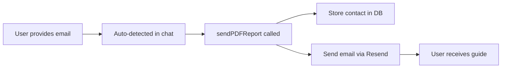

# Resend Email Setup Guide

## 🎯 Quick Setup (5 minutes)

Your Resend email service is already configured! You just need to add your API key.

---

## Step 1: Get Your Resend API Key

1. Go to https://resend.com
2. Sign up or log in (it's free!)
3. Navigate to **API Keys** in the dashboard
4. Click **Create API Key**
5. Give it a name like "MainCrewcutSite"
6. Copy the API key (starts with `re_`)

---

## Step 2: Add API Key to Your Project

Open `.env.local` and replace `re_your_api_key_here` with your actual key:

```bash
# .env.local
VITE_RESEND_API_KEY=re_abc123xyz456...
```

**Important:**
- ✅ Use the VITE_ prefix (required for Vite to expose it)
- ✅ Never commit this file to git (it's in .gitignore)
- ✅ Restart your dev server after adding the key

---

## Step 3: Verify Domain (Optional but Recommended)

For production, verify your domain in Resend:

1. Go to **Domains** in Resend dashboard
2. Click **Add Domain**
3. Enter your domain (e.g., `crewcut.ai`)
4. Add the DNS records they provide to your domain registrar
5. Wait for verification (usually instant)

Once verified, update the "from" email in `src/services/resendService.ts`:

```typescript
from: 'CREW CUT <hello@crewcut.ai>'  // Use your verified domain
```

---

## Step 4: Test It!

```bash
npm run dev
```

Then:
1. Visit http://localhost:5173
2. Open the AI chatbox
3. Type: "I run an e-commerce store"
4. AI will provide 3 solutions
5. Type your email address
6. Check your inbox! 📧

---

## 🎨 What's Included

### Implementation Guide Email

The email includes:
- ✅ Personalized greeting with their name
- ✅ The 3 AI solutions they saw in the chat
- ✅ $50K+/year revenue stat
- ✅ Quick start guide (5 steps)
- ✅ Pro tips for success
- ✅ Recommended AI tools
- ✅ CTA to book a call
- ✅ Beautiful responsive design

### Email Template Location

`src/services/resendService.ts` - function `sendAIImplementationGuide()`

---

## 📊 Resend Free Tier Limits

Your free tier includes:
- ✅ **3,000 emails/month** (plenty for your chatbox!)
- ✅ **Unlimited** verified domains
- ✅ **Unlimited** API keys
- ✅ Email analytics
- ✅ Webhook support

**Cost if you exceed:**
- $1 per 1,000 emails

---

## 🔍 Debugging

### Email Not Sending?

1. **Check API key:**
   ```bash
   echo $VITE_RESEND_API_KEY
   # Should show: re_abc123...
   ```

2. **Check browser console:**
   - Open DevTools (F12)
   - Look for logs:
     - `✅ AI implementation guide sent successfully`
     - `❌ Error sending AI implementation guide`

3. **Common issues:**
   - API key not set → Check `.env.local`
   - Dev server not restarted → `npm run dev` again
   - Using `onboarding@resend.dev` → This works but limited to 1/day per recipient

### Email Goes to Spam?

This happens if using the default `onboarding@resend.dev` sender.

**Solution:** Verify your domain (Step 3 above)

---

## 🛠️ Customization

### Change Email Content

Edit `src/services/resendService.ts` line 191+

```typescript
export const sendAIImplementationGuide = async (data: AIImplementationGuideData) => {
  // Modify the HTML template here
  const guideHtml = `...`;
}
```

### Change Subject Line

Line 330:

```typescript
subject: `💰 Your AI Implementation Guide - Start Making Money Today`,
```

### Add Your Calendly Link

Line 292:

```typescript
<a href="https://calendly.com/your-link" class="cta-button">Book a Free 15-Min Call</a>
```

---

## 📧 How It Works



**Code Flow:**

1. **User types email** → Regex detects it: `test@example.com`
2. **Email detected** → `sendPDFReport(detectedEmail)` called
3. **Contact stored** → `subscribeToNewsletter()` saves lead data
4. **Email sent** → `sendAIImplementationGuide()` via Resend API
5. **Success message** → Chat confirms email sent

---

## 🎯 What's Sent to User

**Email includes:**
- Their first name (if detected)
- Business type (e.g., "Agency", "E-commerce")
- The exact 3 AI solutions the chatbot showed them
- Implementation steps
- Tool recommendations
- CTA to book a call with you

**Data collected:**
```javascript
{
  email: "user@example.com",
  firstName: "Sarah",
  businessType: "Agency",
  teamSize: "20 people",
  company: "Marketing Pros",
  phone: "555-123-4567"  // if provided
}
```

---

## 🔐 Security

- ✅ API key is server-side only (Vite env vars)
- ✅ `.env.local` is gitignored
- ✅ No email validation on frontend (Resend handles it)
- ✅ Graceful error handling (doesn't break chat if email fails)

---

## 📈 Analytics

Track email performance in Resend dashboard:
- **Delivered** - Email successfully sent
- **Opened** - User opened the email
- **Clicked** - User clicked CTA button

---

## 🚀 Production Deployment

When deploying to Firebase/Vercel/Netlify:

1. **Add environment variable** in hosting provider:
   ```
   VITE_RESEND_API_KEY=re_abc123...
   ```

2. **For Firebase Functions:**
   - Already set up in `functions/index.js`
   - Uses Firebase secret manager
   - Set via: `firebase functions:secrets:set RESEND_API_KEY`

3. **Verify domain** (recommended for production)

---

## 💰 Free Tier Breakdown

**Monthly allowance:** 3,000 emails

**Average usage:**
- 100 visitors/day → ~15 leads/day → ~450 emails/month ✅
- 500 visitors/day → ~75 leads/day → ~2,250 emails/month ✅
- 1,000 visitors/day → ~150 leads/day → ~4,500 emails/month ❌ ($1.50 overage)

**Recommendation:** Monitor usage in Resend dashboard. Upgrade to paid plan at $20/month if consistently exceeding.

---

## ✅ Checklist

- [ ] Created Resend account
- [ ] Generated API key
- [ ] Added key to `.env.local`
- [ ] Restarted dev server
- [ ] Tested with real email address
- [ ] Received implementation guide in inbox
- [ ] (Optional) Verified custom domain
- [ ] (Optional) Updated Calendly link
- [ ] (Optional) Customized email template

---

## 🆘 Support

**Resend Support:**
- Docs: https://resend.com/docs
- Support: support@resend.com

**Common Questions:**

**Q: Can I use a Gmail address as sender?**
A: No. Use `onboarding@resend.dev` (free) or verify your own domain.

**Q: How many emails can I test?**
A: Unlimited! But `onboarding@resend.dev` is limited to 1/day per recipient for testing.

**Q: Do I need a credit card?**
A: No! Free tier doesn't require payment info.

**Q: What if email fails to send?**
A: The chat flow continues normally. Error is logged but user experience isn't broken.

---

**🎉 You're all set! Your AI chatbox will now send beautiful implementation guides automatically.**
